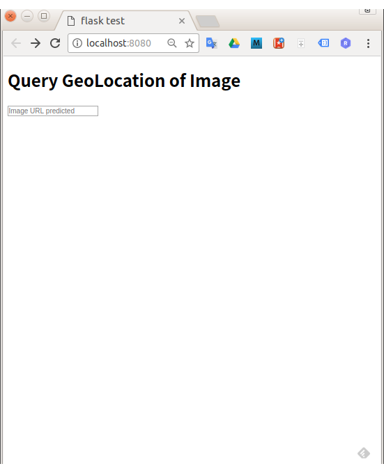
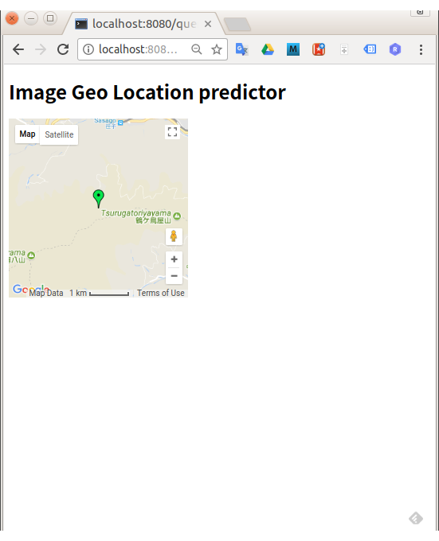

# sage_geoloc_predict
Sample code for hands-on of sage maker

## Prepare data for an inference model

1. Download model data for geolocate prediction

    It'll take a few minutes.
```
$ python prepare_model.py
```

## Preparing model image

1. Build Docker image

    Build inference model as a Docker image
```
$ docker build ./ -t geoloc
```

## Run the prediction service locally

1. Run the docker image

    ```
    $ docker run  -i -t geoloc
    ```

1. Modify a code for local running

    ```diff
    diff --git a/query.py b/query.py
    index 3d57aea..d9ceeea 100644
    --- a/query.py
    +++ b/query.py
    @@ -31,15 +31,15 @@ def request_predict():
        # return render_template('query.html', title='flask test', url=request.form['city1'])
        # return "The cities are: {}, {}, {}".format(request.form['city1'], request.form['city2'], request.form['city3'])
    
    -    # r = requests.post('http://172.17.0.2:8080/invocations', json = { 'url':request.form['url'] }).json()
    +    r = requests.post('http://172.17.0.2:8080/invocations', json = { 'url':request.form['url'] }).json()
    
    -    data = {'url': request.form['url'] }
    -    res_invoke = sagemaker.invoke_endpoint(
    -        EndpointName='predict',
    -        Body=json.dumps(data)
    -    )
    -    streamingBody = res_invoke['Body'] 
    -    r = json.loads(streamingBody.read())
    +    # data = {'url': request.form['url'] }
    +    # res_invoke = sagemaker.invoke_endpoint(
    +    #     EndpointName='predict',
    +    #     Body=json.dumps(data)
    +    # )
    +    # streamingBody = res_invoke['Body'] 
    +    # r = json.loads(streamingBody.read())
 
     print(r)
 
    ```

1. Replaced `*******` parts in query.py by AWS credentials and google map API key

1. Start a flask wep application

    ```
    pip install -r requirements.txt
    python query.py
    ```

1. Access http://localhost:8080/

1. After confirming to work fine, rollback the modification for local running.

## Push the model image into AWS ECR

1. Push the Docker image into AWS ECR

    Just follow the following instruction:

    http://docs.aws.amazon.com/AmazonECR/latest/userguide/docker-basics.html#use-ecr

## Creating model and endpoint on SageMaker

1. Create a new model using your Docker image on ECR
1. Create an endpoint for inference of the new model

    The following instruction is quite useful for the above.

    https://aws.amazon.com/jp/blogs/aws/sagemaker/  
    Using Custom Docker Containers

## Deploy the flask web application on CF

1. Log in CF api endpoint

    ```
    $ cf login -a  https://api.run.pivotal.io
    ```

1. Push app

    ```
    $ cf push
    ```

# Screenshot

 
